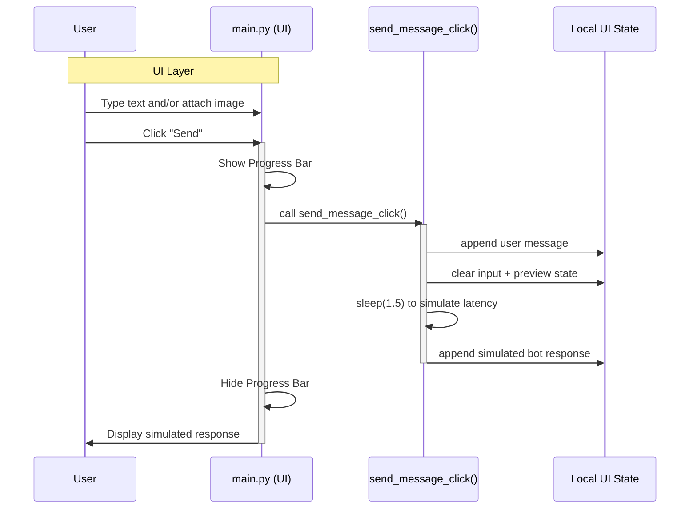

# Data Flow Simulation

This document provides a visual simulation of the data flow within the AETHERIUM-LM demo UI.
It focuses on the interaction between the User Interface (UI) state and user events.

## 1. High-Level System Architecture

The following diagram illustrates the general structure of the application and how data moves between layers.

```mermaid
graph TD
    %% Nodes
    User([User])
    UI[main.py <br/> (Flet UI)]
    Service[main.py <br/> (UI Event Handlers)]
    State[(In-memory UI state)]
    Simulated[(Simulated assistant response)]

    %% Styles
    style UI fill:#e1f5fe,stroke:#01579b,stroke-width:2px
    style Service fill:#fff9c4,stroke:#fbc02d,stroke-width:2px
    style State fill:#e0f2f1,stroke:#00695c,stroke-width:2px,shape:cylinder
    style Simulated fill:#f3e5f5,stroke:#7b1fa2,stroke-width:2px

    %% Flow
    User -- "1. Types message / attaches image" --> UI
    UI -- "2. Triggers send handler" --> Service
    Service -- "3. Updates local state" --> State
    Service -- "4. Builds simulated response" --> Simulated
    Simulated -- "5. Render response" --> UI
    UI -- "6. Updates display" --> User
```

### Description of Components
- **User**: The person interacting with the demo app.
- **main.py (UI)**: Presentation + event handling for message submission and image attachment.
- **In-memory UI state**: Holds selected image path and rendered message list.
- **Simulated assistant response**: A local, non-network placeholder response.

---

## 2. Message Send Sequence

This diagram details the sequence when a user sends a chat message in the demo UI.



### Flow Explanation
1.  **Input**: The user enters text or selects an image.
2.  **UI update**: `main.py` appends the user message and clears transient input state.
3.  **Simulation**: The handler waits briefly, then composes a local response.
4.  **Render**: The response is shown in the chat panel.
